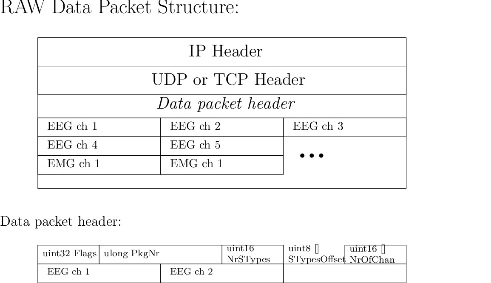

Data Packet
===========

Fixed Header
------------

=============== ============= ================== ============================================
Position (Byte) Length (Byte) Type               Content
=============== ============= ================== ============================================
0               1	      unsigned integer   Datapacket Version has to be 3
1               4             unsigned integer   Packet size (in bytes), little endian
5               4             unsigned integer   Signal type flags
9               8             unsigned integer   Packet id
17              8             unsigned integer   Connection packet number
25              8             unsigned integer   Time stamp
=============== ============= ================== ============================================

Byte Order
**********
All data and fields are transmitted in little endian.

Packet Size
***********
The packet size is the total number of bytes (octets) of a datapacket including the fixed header,
the variable header and the data. 

The packet size of an empty datapacket is 33.

Time Stamp
**********
microseconds since server start

Variable Header
---------------

Remarks:

* NoS is the number of signals. This number can be determined by counting the flags which are set
  in the "signal type flags" field of the fixed header.

=============== ============= =============================== ====================================================
Position (Byte) Length (Byte) Type                            Content
=============== ============= =============================== ====================================================
33              2 * NoS	      Array of 16bit unsigned integer Number of channels
33 + (2 * NoS)  2 * NoS       Array of 16bit unsigned integer Block size of signal (number of samples per channel)
=============== ============= =============================== ====================================================

Data
----

Data starts at the position 33 + (4 * NoS).
